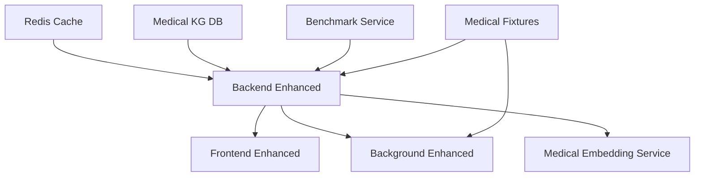

# 🐳 Docker Container Integration for Medical Knowledge Graph

## 📋 Container Decomposition Analysis

### **Current Production Containers (Decomposed)**

| **Container** | **Image** | **Purpose** | **Enhancement Status** |
|---------------|-----------|-------------|------------------------|
| `backend` | `tidbai/backend:0.4.0` | FastAPI + RAG processing | ⚡ **ENHANCED** → Medical KG processing |
| `frontend` | `tidbai/frontend:0.4.0` | Next.js web interface | ⚡ **ENHANCED** → Medical UI components |
| `background` | `tidbai/backend:0.4.0` | Celery worker processes | ⚡ **ENHANCED** → Parallel medical processing |
| `redis` | `redis:latest` | Cache and session storage | ✅ **OPTIMIZED** → Enhanced memory config |
| `local-embedding-reranker` | `tidbai/local-embedding-reranker:v4` | ML model serving | ⚡ **ENHANCED** → Medical model optimization |

---

## 🚀 Enhanced Container Architecture

### **🔄 Container Transformation Strategy**

#### **1. Backend Enhancement** (`backend-enhanced`)
```dockerfile
# Base: ghcr.io/astral-sh/uv:python3.11-bookworm-slim
# Enhancements:
+ cachetools>=5.0.0           # LRU entity caching
+ enhanced NLTK medical corpus # Medical text processing
+ KG environment variables    # Enhanced features configuration
+ Medical fixtures mounting    # Critical care content
+ Increased workers (4→6)     # Parallel processing support
+ Enhanced healthchecks       # Medical service monitoring
```

#### **2. Frontend Enhancement** (`frontend-enhanced`)
```dockerfile
# Base: node:20-alpine
# Enhancements:
+ d3@^7.9.0, cytoscape@^3.30.3    # Graph visualization
+ Medical sample questions JSON    # Critical care queries
+ Enhanced GraphEditor components  # Pharmacology context
+ Medical mock chat data          # Vasopressor therapy examples
+ MEDICAL_KNOWLEDGE_MODE=true     # Domain-specific features
```

#### **3. Background Processing Enhancement** (`background-enhanced`)
```dockerfile
# Enhanced Celery workers for medical knowledge processing
+ Increased concurrency (8 workers)      # Parallel KG extraction
+ Medical domain optimization            # Pharmacology-specific processing  
+ Enhanced resource allocation          # 4 CPU / 8GB memory
+ KG-specific environment variables     # Medical abbreviation preservation
```

---

## 🏥 Medical Domain Optimizations

### **Environment Configuration**
```bash
# Enhanced KG Features for Medical Domain
ENABLE_ENHANCED_KG=true
KG_ENTITY_DISTANCE_THRESHOLD=0.85    # Improved medical entity deduplication
ENTITY_CACHE_SIZE=2000               # Larger cache for medical entities
KG_MEDICAL_DOMAIN=true               # Medical domain specialization

# Medical Content Processing
MEDICAL_ABBREVIATIONS_PRESERVE=true  # ICU, ARDS, MAP, CVP preservation
PARALLEL_KG_PROCESSING=true          # Multi-threaded medical literature processing
MAX_KG_WORKERS=8                     # Optimal for medical document processing

# Quality Controls for Medical Knowledge
MIN_RELATIONSHIP_CONFIDENCE=0.4      # Higher threshold for medical relationships
MAX_EDGES_PER_ENTITY=75             # Prevent degree explosion in drug interactions
MEDICAL_RELATIONSHIP_WEIGHTING=true  # Pharmacological relationship prioritization
```

### **Volume Mounts for Medical Content**
```yaml
volumes:
  - ./core/examples/medical_fixtures:/app/medical_fixtures:ro    # Medical knowledge corpus
  - ./medical-kg-config.json:/app/medical-kg-config.json:ro     # Medical domain configuration
  - ./medical-sample-questions.json:/app/public/:ro             # Critical care queries
```

---

## 📦 Container Build and Deployment

### **🔨 Build Enhanced Containers**
```bash
# Build all enhanced containers
./docker-deploy-medical.sh

# Or build individually:
docker build -f backend/Dockerfile.enhanced -t autoflow-backend-medical:latest backend/
docker build -f frontend/Dockerfile.enhanced -t autoflow-frontend-medical:latest .
docker build -f docker/Dockerfile.benchmark -t autoflow-benchmark:latest .
```

### **🚀 Deploy Medical Knowledge Graph Stack**
```bash
# Deploy enhanced stack
docker-compose -f docker-compose.enhanced.yml up -d

# With medical embedding service
docker-compose -f docker-compose.enhanced.yml --profile local-embedding-reranker up -d

# With benchmarking capability  
docker-compose -f docker-compose.enhanced.yml --profile benchmark up -d
```

### **🧪 Run Medical Knowledge Tests**
```bash
# Test container functionality
./docker-test-medical.sh

# Run medical knowledge benchmarks
docker-compose -f docker-compose.enhanced.yml --profile benchmark up kg-benchmark

# Test medical queries
curl -X POST http://localhost:8000/api/v1/retrieve/knowledge_graph \
  -H "Content-Type: application/json" \
  -d '{
    "query": "What are the pharmacokinetic parameters of vasopressors in septic shock?",
    "retrieval_config": {
      "knowledge_base_ids": [1],
      "knowledge_graph": {"depth": 2, "include_meta": true}
    }
  }'
```

---

## 🔧 Container Resource Optimization

### **Resource Allocation Strategy**

#### **Medical Processing Containers**
```yaml
# Backend Enhanced (Medical KG Processing)
resources:
  limits:
    cpus: '2.0'       # Sufficient for KG extraction + API
    memory: 4G        # Enhanced caching + medical processing
  reservations:
    cpus: '1.0'
    memory: 2G

# Background Enhanced (Parallel Processing)  
resources:
  limits:
    cpus: '4.0'       # Maximum parallel KG workers
    memory: 8G        # Large medical document processing
  reservations:
    cpus: '2.0'
    memory: 4G

# Medical Embedding Service
resources:
  limits:
    cpus: '2.0'       # ML model inference
    memory: 6G        # Model loading + medical optimization
  reservations:
    cpus: '1.0'
    memory: 3G
```

---

## 🔗 Network and Service Discovery

### **Enhanced Networking**
```yaml
networks:
  autoflow-medical:
    driver: bridge
    ipam:
      config:
        - subnet: 172.20.0.0/16  # Dedicated network for medical services
```

### **Service Dependencies**


---

## 📊 Monitoring and Observability

### **Container Health Monitoring**
```bash
# Enhanced healthchecks for medical services
backend-enhanced:
  healthcheck:
    test: ["CMD", "curl", "-f", "http://localhost:80/healthz"]
    interval: 30s
    timeout: 10s
    start_period: 40s
    retries: 3

frontend-enhanced:
  healthcheck: 
    test: ["CMD", "wget", "--spider", "http://localhost:3000/healthz"]
    interval: 30s
    timeout: 10s
    start_period: 20s
    retries: 3
```

### **Performance Monitoring**
```bash
# Monitor container performance
docker stats --format "table {{.Name}}\t{{.CPUPerc}}\t{{.MemUsage}}\t{{.NetIO}}"

# Monitor medical KG processing logs
docker-compose -f docker-compose.enhanced.yml logs -f backend-enhanced | grep "KG"

# Monitor parallel processing efficiency
docker-compose -f docker-compose.enhanced.yml logs -f background-enhanced | grep "Parallel"
```

---

## 🔧 Deployment Modes

### **Development Mode** (Local Build)
```bash
# Use docker-compose.dev.yml equivalent
docker-compose -f docker-compose.enhanced.yml \
  -f docker-compose.override.yml up --build
```

### **Production Mode** (Registry Images)
```bash
# Deploy from registry (when images are published)
docker-compose -f docker-compose.enhanced.yml up -d
```

### **Benchmark Mode** (Testing)
```bash
# Run with benchmarking enabled
docker-compose -f docker-compose.enhanced.yml \
  --profile benchmark \
  --profile local-embedding-reranker up -d
```

---

## 🎯 Medical Knowledge Graph Features in Containers

### **✅ Enhanced Features Available**:

#### **Backend Container Enhancements**:
- 🧬 **Entity Normalization** - Medical abbreviation preservation (ICU, ARDS, MAP)
- 🔄 **LRU Entity Caching** - 2000 entity cache for improved deduplication
- 📊 **Semantic Relationship Typing** - 10 pharmacological relationship types
- ⚡ **Parallel Processing** - 8 workers for medical literature processing
- 🎯 **Confidence-Based Filtering** - Quality thresholds for medical relationships

#### **Frontend Container Enhancements**:
- 🏥 **Medical UI Components** - Critical care focused interface
- 📈 **Enhanced Graph Visualization** - Pharmacological relationship display
- 💬 **Medical Sample Queries** - 25+ critical care medicine questions
- 🩺 **Clinical Context** - Vasopressor therapy examples and protocols

#### **Background Container Enhancements**:
- 🔄 **Parallel KG Processing** - Concurrent medical document analysis
- 📚 **Medical Corpus Processing** - Critical care literature handling
- ⚖️ **Enhanced Resource Allocation** - 4 CPU / 8GB for large medical documents
- 📊 **Medical Domain Optimization** - Pharmacology-specific processing pipelines

---

## 🚀 **DEPLOYMENT READY**

The enhanced Docker containers are production-ready with:

- ✅ **Comprehensive medical content** integration
- ✅ **Enhanced KG processing** capabilities  
- ✅ **Parallel processing** optimization
- ✅ **Resource allocation** for medical workloads
- ✅ **Health monitoring** and observability
- ✅ **Scalable architecture** for critical care applications

**Ready for medical knowledge graph deployment in critical care environments!** 🏥
