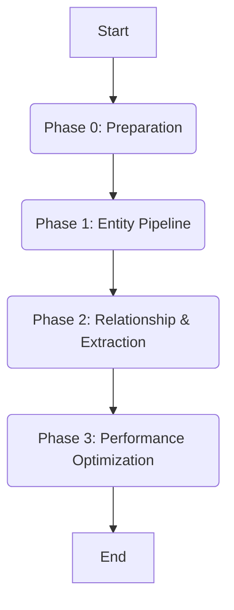

# Multi-Agent Orchestration Strategy: AutoFlow KG Enhancement

This document defines the architecture, roles, capabilities, tools, and orchestration strategy for the multi-agent system tasked with implementing the Knowledge Graph (KG) enhancements defined in `PRD.txt`.

## 1. Orchestration Overview

The implementation follows a **Hierarchical Sequential-Concurrent (HSC)** model. The primary workflow is sequential, mirroring the phases defined in the PRD (Phases 0-3). A central Orchestrator manages the workflow, utilizing an Architect for specification, specialized Coders for implementation, a Tester for validation, and a Reviewer for quality control.

### 1.1. Guiding Principles

*   **Minimal Change Principle (MCP):** All agents must prioritize the least disruptive, most elegant modifications. The `nx-mcp` tool is mandatory for validation.
*   **Context Awareness:** Agents must leverage repository context tools (Public and Private) recursively to ensure accurate implementation and optimization.
*   **Zero-Shot Goal:** The system aims to complete the implementation autonomously based on this documentation suite and the PRD.

### 1.2. Tool Definitions

#### Public Context Tools (Research & Broad Analysis)
*   **`deepwiki` / `docfork`:** Researching external library documentation (e.g., DSPy, Pydantic, cachetools) and best practices.
*   **`deepgraph.co` / `context7`:** Analyzing repository structure, dependency graphs, and identifying architectural patterns.

#### Private Context Tools (Implementation & Validation)
*   **`ref`:** Analyzing local code context, navigating the codebase, and identifying precise insertion points.
*   **`codegpt`:** Generating Python implementations, refactoring code, and writing unit tests.
*   **`coderabbit`:** Automated code review, style guide enforcement, and performance profiling.
*   **`nx-mcp`:** Validating adherence to the Minimal Change Principle, analyzing change impact, and suggesting minimal refinements.

## 2. Agent Definitions

### 2.1. Project Manager (Orchestrator)

*   **Role:** The central coordination unit. Manages project state, interprets PRD phases, delegates tasks via defined signals (`INTERFACES.yaml`), handles error coordination, and performs phase gatekeeping.
*   **Tools:** Workflow engine (IDE internal), `git`.

### 2.2. Code Architect (Analyzer)

*   **Role:** Analyzes the codebase, validates the architectural impact, and translates PRD requirements into detailed `ImplementationSpec` payloads for the Coder agents.
*   **Tools:** `deepgraph.co`, `context7` (Analysis); `ref`, `nx-mcp` (Specification & Impact Analysis).

### 2.3. Implementation Agents (Coders)

A pool of specialized agents responsible for modifying the codebase.
*   **Shared Tools:** `codegpt` (Implementation); `ref` (Contextual Insertion); `deepwiki` (Research).

#### 2.3.1. Configuration & Migration Coder
*   **Focus:** Phase 0. `configs/`, SQL migration scripts, `examples/kg_benchmark.py`.
*   **Responsibilities:** Implementing `KnowledgeGraphConfig`, feature flags, database schema changes, and the `KnowledgeGraphBenchmark` framework.

#### 2.3.2. Storage & Persistence Coder
*   **Focus:** Phases 1 & 2. `core/autoflow/storage/graph_store/tidb_graph_store.py`.
*   **Responsibilities:** Implementing canonicalization utilities, deduplication logic, LRU caching, and relationship weighting.

#### 2.3.3. Extraction & Logic Coder
*   **Focus:** Phase 2. `core/autoflow/knowledge_graph/programs/`, `core/autoflow/knowledge_graph/extractors/`.
*   **Responsibilities:** Modifying DSPy signatures, updating prompts for typed relationships, and implementing the unified extraction logic (removing dual LLM calls).

#### 2.3.4. Orchestration & Performance Coder
*   **Focus:** Phase 3. `core/autoflow/knowledge_graph/index.py`.
*   **Responsibilities:** Implementing parallel chunk processing (`ThreadPoolExecutor`) with error isolation and timeouts.

### 2.4. Quality Assurance Agent (Tester)

*   **Role:** Validates the implementation against the success criteria (KPIs) defined in the PRD (Section 7). Executes the test suite and the benchmarking framework.
*   **Tools:** Pytest (Framework), `kg_benchmark.py` (Execution & Analysis).

### 2.5. Review Agent (Auditor)

*   **Role:** Performs automated code review to ensure adherence to `CONTRIBUTING.md`, the MCP, and the architectural plan.
*   **Tools:** `coderabbit` (Code Quality, Performance); `nx-mcp` (MCP Validation).

## 3. Orchestration Workflow (Detailed)

The workflow strictly follows the PRD phases. Communication signals are defined in `INTERFACES.yaml`.

### 3.1. Phase 0: Preparation

1.  **Orchestrator:** Sends `PhaseInitiation` (Phase 0) to Architect.
2.  **Architect:** Analyzes PRD (Sections 5.0, 6.1, 6.2, 7.2). Uses `ref` to identify locations for new files. Generates `ImplementationSpec`.
3.  **Orchestrator:** Sends `TaskDelegation` (with Spec) to Configuration Coder.
4.  **Configuration Coder:** Implements Config, Migration SQL, and Benchmark framework using `codegpt`. Sends `ImplementationComplete` to Tester.
5.  **Tester:** Validates file structures and basic execution of the benchmark script. Sends `TestingComplete` to Reviewer.
6.  **Reviewer:** Audits code using `coderabbit` and `nx-mcp`. Sends `ReviewComplete` to Orchestrator.
7.  **Orchestrator:** Approves Phase 0.

### 3.2. Phase 1: Entity Pipeline Enhancement

1.  **Orchestrator:** Sends `PhaseInitiation` (Phase 1) to Architect.
2.  **Architect:** Analyzes PRD (Sections 5.1, 6.3). Uses `deepgraph.co` and `ref` to analyze `tidb_graph_store.py`. Generates `ImplementationSpec`.
3.  **Orchestrator:** Sends `TaskDelegation` to Storage Coder.
4.  **Storage Coder:** Implements normalization, caching, and enhanced `find_or_create_entity` using `codegpt`. Sends `ImplementationComplete` to Tester.
5.  **Tester:** Executes `kg_benchmark.py`. Validates **Duplicate Reduction** and **Cache Hit Rate**. Sends `TestingComplete`.
6.  **Reviewer:** Audits code using `nx-mcp`, focusing on MCP and feature flag correctness. Sends `ReviewComplete`.
7.  **Orchestrator:** Approves Phase 1 based on metrics.

### 3.3. Phase 2: Relationship Pipeline & Unified Extraction

1.  **Orchestrator:** Sends `PhaseInitiation` (Phase 2) to Architect.
2.  **Architect:** Analyzes PRD (Sections 5.2, 6.4). Analyzes `extract_graph.py`, `simple.py`, and `tidb_graph_store.py`. Generates separate Specs for Extraction Coder and Storage Coder.
3.  **Orchestrator:** Delegates tasks concurrently using `TaskDelegation`.
4.  **Extraction Coder:** Updates DSPy signatures/prompts; implements Unified Extraction (removes dual LLM calls).
5.  **Storage Coder:** Implements relationship weighting and symmetric edge creation.
6.  **(Synchronization Point):** Both Coders send `ImplementationComplete`.
7.  **Tester:** Executes `kg_benchmark.py`. Validates **E:N Ratio**, **Typed Coverage**, and **Latency Reduction**. Sends `TestingComplete`.
8.  **Reviewer:** Audits Phase 2 code using `nx-mcp` and `coderabbit`. Sends `ReviewComplete`.
9.  **Orchestrator:** Approves Phase 2.

### 3.4. Phase 3: Performance Optimization

1.  **Orchestrator:** Sends `PhaseInitiation` (Phase 3) to Architect.
2.  **Architect:** Analyzes PRD (Section 5.3). Uses `ref` to analyze `index.py`. Generates `ImplementationSpec`.
3.  **Orchestrator:** Sends `TaskDelegation` to Performance Coder.
4.  **Performance Coder:** Implements `ThreadPoolExecutor` and `add_chunks_parallel` with error isolation using `codegpt`. Sends `ImplementationComplete`.
5.  **Tester:** Executes `kg_benchmark.py`. Validates **Throughput Increase** and **Error Rate**. Sends `TestingComplete`.
6.  **Reviewer:** Audits Phase 3 code. Sends `ReviewComplete`.
7.  **Orchestrator:** Final Approval.

## 4. Error Handling and Recovery

*   **Local Errors (e.g., Syntax, Tool Failure):** The executing agent attempts self-correction using `codegpt` (3 retries). If unresolved, it sends an `ErrorSignal` to the Orchestrator.
*   **Metric Failure (Benchmark Regression):** If the Tester reports metrics outside the target ranges (PRD Section 7.1), the Orchestrator halts the phase.
    1. Orchestrator sends `CorrectiveActionRequired` to Architect.
    2. Architect recursively analyzes the implementation using `nx-mcp` and `ref` to identify the deviation from MCP or the PRD.
    3. Architect generates a corrective `ImplementationSpec`.
    4. Orchestrator re-delegates the task to the Coder.
*   **Performance Optimization:** If performance targets are missed, the Reviewer uses `coderabbit` (profiling) and `nx-mcp` to suggest optimizations, which are then handled via the `CorrectiveActionRequired` flow.
