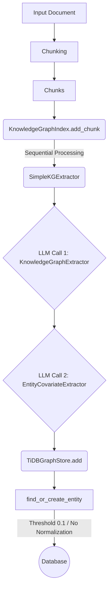
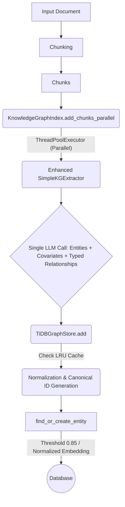

## 1. Overview

This document provides a comprehensive architectural plan for enhancing the `pingcap/autoflow` KG pipeline. The current implementation suffers from entity proliferation (due to weak deduplication and lack of normalization), absence of semantic relationship typing, and performance bottlenecks (sequential LLM calls, sequential chunk processing, and database inefficiencies).

This PRD outlines a strategy focused on **minimal, elegant modifications** to existing components. The plan introduces canonicalization, typed relationships with weighting, unified LLM extraction, parallel processing, and caching, all managed via feature flags. This document is designed to serve as a complete, stand-alone execution guide for an AI coding agent.

## 2. Glossary

*   **KG:** Knowledge Graph.
*   **E:N Ratio:** Edge-to-Node Ratio. Target: ~4:1.
*   **Canonicalization:** The process of converting entity names into a standard, normalized form (e.g., lowercase, NFKC normalized, punctuation stripped).
*   **Deduplication Threshold:** The cosine similarity score required to consider two entities the same. Target: 0.85 (up from 0.1).
*   **Unified Extraction:** Combining entity, covariate, and relationship extraction into a single LLM call.
*   **DSPy:** A framework used in AutoFlow for optimizing LM prompts.
*   **MCP:** Minimal Change Principle.

## 3. Current Architecture Analysis (As-Is)

The current pipeline follows a `Load -> Chunk -> Extract (Sequential) -> Store (Individual)` pattern.

### 3.1. Data Flow



### 3.2. Identified Issues and Code Citations

1.  **Entity Proliferation & Weak Deduplication:**
    *   `core/autoflow/storage/graph_store/tidb_graph_store.py`: `__init__` defaults `entity_distance_threshold` to 0.1. `find_or_create_entity` uses this low threshold without name normalization, leading to high duplication rates (Est. 40%).
2.  **Untyped Relationships & Zero Weighting:**
    *   `core/autoflow/knowledge_graph/programs/extract_graph.py`: `PredictRelationship` only includes `relationship_desc`. No semantic types (hypernym, meronym, synonym, etc.) or confidence scores are extracted.
3.  **Sequential LLM Calls (Latency/Cost):**
    *   `core/autoflow/knowledge_graph/extractors/simple.py`: `extract` calls `KnowledgeGraphExtractor` and `EntityCovariateExtractor` sequentially, doubling LLM calls per chunk.
4.  **Sequential Chunk Processing (Throughput):**
    *   `core/autoflow/knowledge_graph/index.py`: `add_text` and `add_chunk` process items one by one.
5.  **Database Inefficiencies:**
    *   `tidb_graph_store.py`: Lack of in-memory caching leads to repeated lookups and potential "need-revised" duplicate entities during ingestion.

## 4. Solution Architecture (To-Be)

### 4.1. Design Principles

*   **Minimalism (MCP):** Modify existing code paths rather than introducing complex new modules. Fix multiple issues simultaneously (e.g., Unified Extraction addresses latency and enables typed relationships).
*   **Backward Compatibility:** All changes must be gated behind feature flags. Public APIs remain unchanged.
*   **Configurability:** Use a centralized configuration object (`KnowledgeGraphConfig`) with environment variable overrides.
*   **Evaluability:** Implement a benchmarking framework (`KnowledgeGraphBenchmark`) to measure the impact of changes.

### 4.2. High-Level Architecture Changes

The enhanced pipeline follows a `Load -> Chunk -> Extract (Parallel, Unified) -> Store (Cached, Normalized)` pattern.



## 5. Implementation Roadmap (Execution Steps)

The implementation must follow this sequence. The AI coding agent should execute these steps iteratively, validating with the benchmark after each phase.

### Phase 0: Preparation (Configuration, Migration, Evaluation)

1.  **Configuration System:** Create `core/autoflow/configs/knowledge_graph.py`.
    *   Define `KnowledgeGraphConfig` (Pydantic BaseModel).
    *   Implement flags, thresholds, and ENV variable overrides (See Section 6.1).
2.  **Database Migration:** Create a migration script (e.g., `migrations/001_kg_enhancements.sql`).
    *   Add columns for `canonical_id`, `normalized_name`, `relationship_type`, `confidence`, and `weight` (See Section 6.2).
3.  **Evaluation Framework:** Create `examples/kg_benchmark.py`.
    *   Implement `KnowledgeGraphBenchmark` to measure baseline vs. enhanced performance (See Section 7.2).

### Phase 1: Entity Pipeline Enhancement (Deduplication & Caching)

1.  **Update `TiDBGraphStore` Initialization:** Modify `core/autoflow/storage/graph_store/tidb_graph_store.py::__init__`.
    *   Accept `KnowledgeGraphConfig`.
    *   Set `_entity_distance_threshold` based on the config.
    *   Initialize the LRU entity cache (`self._entity_cache`) using `cachetools.LRUCache` if enhanced KG is enabled.
2.  **Implement Normalization Utilities:** Add `_normalize_entity_name` and `_get_canonical_id` in `tidb_graph_store.py` (See Section 6.3).
3.  **Enhance Embedding Generation:** Modify `_get_entity_embedding` to use the normalized name if enabled.
4.  **Enhance `find_or_create_entity`:**
    *   Integrate `_get_canonical_id`.
    *   Check `self._entity_cache` before DB lookup.
    *   Use the configured threshold for similarity search.
    *   Store `canonical_id`, `normalized_name`, and `aliases` in metadata upon creation.
    *   Update the cache upon finding or creation.

### Phase 2: Relationship Pipeline & Unified Extraction

1.  **Update DSPy Signatures:** Modify `core/autoflow/knowledge_graph/programs/extract_graph.py`.
    *   Update `PredictRelationship` to include `relationship_type` and `confidence`. Update the prompt/docstring to specify the required semantic types.
    *   Update `PredictEntity` (or the corresponding structure in the unified prompt) to include covariates (e.g., `entity_type`).
2.  **Update `KnowledgeGraphExtractor.forward`:** Ensure the output `GeneratedKnowledgeGraph` populates the `meta` field with the new data (types, confidence, covariates) from the unified LLM response.
3.  **Unify Extraction Logic:** Modify `core/autoflow/knowledge_graph/extractors/simple.py::extract`.
    *   **Crucial MCP Step:** Remove the separate call to `EntityCovariateExtractor`. The `KnowledgeGraphExtractor` now handles everything.
4.  **Implement Relationship Weighting:** Modify `tidb_graph_store.py::create_relationship`.
    *   Calculate `weight` using the defined formula (See Section 6.4).
    *   Store `weight`, `type`, and `confidence`.
    *   If `relationship_type` is symmetric (synonym/antonym), automatically create the inverse relationship.

### Phase 3: Performance Optimization (Parallelism)

1.  **Implement Parallel Processing:** Modify `core/autoflow/knowledge_graph/index.py`.
    *   Update `__init__` to initialize a `ThreadPoolExecutor` (`self._executor`) based on `KnowledgeGraphConfig`.
    *   Implement `add_chunks_parallel`. Use the executor to process chunks concurrently.
    *   Implement error isolation (`process_chunk_safe`) and timeouts to ensure robustness.

## 6. Detailed Implementation Guidance

### 6.1. Configuration (`core/autoflow/configs/knowledge_graph.py`)

```python
import os
from pydantic import BaseModel
from typing import Optional

# Determine the master switch state from ENV variable
ENABLE_ENHANCED_KG = os.getenv("ENABLE_ENHANCED_KG", "False").lower() == "true"

class KnowledgeGraphConfig(BaseModel):
    """Configuration for enhanced knowledge graph features"""
    
    # Feature Toggles
    enable_enhanced_kg: bool = ENABLE_ENHANCED_KG
    canonicalization_enabled: bool = True
    typed_relationships_enabled: bool = True
    alias_tracking_enabled: bool = True
    parallel_processing_enabled: bool = True
    create_symmetric_relationships: bool = True
    
    # Entity Thresholds
    # Default to 0.85 if enhanced KG is enabled, otherwise fallback to legacy 0.1. Allow override via ENV.
    entity_distance_threshold: float = float(os.getenv("KG_ENTITY_DISTANCE_THRESHOLD", 0.85 if ENABLE_ENHANCED_KG else 0.1))
    
    # Performance Tuning
    entity_cache_size: int = int(os.getenv("ENTITY_CACHE_SIZE", 1000))
    max_workers: Optional[int] = None # Defaults to CPU count + 4 in KnowledgeGraphIndex
    chunk_timeout_seconds: int = 30
    
    # Quality Guardrails
    min_relationship_confidence: float = 0.3
    max_edges_per_entity: int = 50
```

### 6.2. Database Migration Script (SQL)

```sql
-- migrations/001_kg_enhancements.sql

-- Add enhanced entity columns (backward compatible with defaults)
-- Ensure IF NOT EXISTS is used if supported by the TiDB dialect, otherwise check schema before alteration.
ALTER TABLE entities 
ADD COLUMN IF NOT EXISTS canonical_id VARCHAR(32) DEFAULT NULL,
ADD COLUMN IF NOT EXISTS normalized_name VARCHAR(500) DEFAULT NULL;
-- Note: 'aliases' are recommended to be stored within the 'meta' JSON field to minimize schema changes, 
-- unless a dedicated aliases table is strictly required.

-- Add enhanced relationship columns
ALTER TABLE relationships 
ADD COLUMN IF NOT EXISTS relationship_type VARCHAR(50) DEFAULT 'generic',
ADD COLUMN IF NOT EXISTS confidence FLOAT DEFAULT 0.8,
ADD COLUMN IF NOT EXISTS weight FLOAT DEFAULT 0.0;

-- Add performance indexes
CREATE INDEX IF NOT EXISTS idx_entities_canonical_id ON entities(canonical_id);
CREATE INDEX IF NOT EXISTS idx_relationships_type ON relationships(relationship_type);
CREATE INDEX IF NOT EXISTS idx_relationships_weight ON relationships(weight DESC);
```

### 6.3. Entity Normalization & Caching (`tidb_graph_store.py`)

**Initialization (Update):**

```python
# Ensure imports: from cachetools import LRUCache
# ... in __init__ ...
    self._config = config or KnowledgeGraphConfig()
    if self._config.enable_enhanced_kg:
        self._entity_cache = LRUCache(maxsize=self._config.entity_cache_size)
    else:
        self._entity_cache = None
```

**Normalization Utilities (New):**

```python
import re
import unicodedata
import hashlib

def _normalize_entity_name(self, name: str) -> str:
    if not self._config.enable_enhanced_kg or not self._config.canonicalization_enabled:
        return name
    
    # Unicode normalization (NFKC) + lowercase + strip whitespace
    normalized = unicodedata.normalize('NFKC', name.lower().strip())
    # Remove punctuation except hyphens; keep alphanumeric and spaces
    normalized = re.sub(r'[^\w\s\-]', '', normalized)
    # Normalize internal whitespace to single space
    normalized = ' '.join(normalized.split())
    return normalized

def _get_canonical_id(self, name: str, description: str) -> str:
    if not self._config.enable_enhanced_kg:
        return name # Legacy behavior proxy
        
    canonical_name = self._normalize_entity_name(name)
    # Content-based ID using name and first 100 chars of description for context
    content = f"{canonical_name}::{description[:100] if description else ''}"
    return hashlib.sha256(content.encode()).hexdigest()[:16]
```

### 6.4. Relationship Weighting Formula (`tidb_graph_store.py::create_relationship`)

```python
# ... inside create_relationship ...
    if self._config.enable_enhanced_kg and self._config.typed_relationships_enabled:
        # Define base weights
        type_weights = {
            "hypernym": 1.0, "hyponym": 1.0,  # Strong taxonomic
            "meronym": 0.9, "holonym": 0.9,   # Strong structural  
            "synonym": 0.95,                  # Very strong semantic
            "antonym": 0.9,
            "causal": 0.8,                    # Important functional
            "temporal": 0.7,                  # Moderate sequential
            "reference": 0.6,                 # Weaker citation
            "generic": 0.5                    # Default
        }

        relationship_type = meta.get("relationship_type", "generic")
        confidence = meta.get("confidence", 0.8)

        # Calculate weight (0-10 scale)
        weight = confidence * type_weights.get(relationship_type, 0.5) * 10
        
        # ... (Update enhanced_meta and handle symmetry) ...
```

## 7. Evaluation and Success Criteria

### 7.1. Key Metrics (KPIs)

| Metric                      | Current State (Est.) | Target State | Improvement Goal |
| --------------------------- | -------------------- | ------------ | ---------------- |
| Duplicate Entity Rate       | 40%                  | ≤ 10%        | ≥ 75% reduction  |
| Entity Merge Precision      | N/A                  | ≥ 0.95       | N/A              |
| Edge-to-Node (E:N) Ratio    | 1.5:1 - 2:1          | ~4:1         | ~100% increase   |
| Typed Relationship Coverage | 0%                   | ≥ 85%        | N/A              |
| Processing Latency (Chunk)  | 2x LLM calls         | 1x LLM call  | 50% reduction    |
| Throughput (Entities/Sec)   | Low (Sequential)     | High         | 3x-5x increase   |

### 7.2. Benchmarking Procedure

The `KnowledgeGraphBenchmark` (implemented in Phase 0) is the tool for validation.

1.  **Setup:** Select a representative corpus of test documents.
2.  **Baseline Run:** Execute the pipeline with `KnowledgeGraphConfig(enable_enhanced_kg=False)`. Record metrics.
3.  **Enhanced Run:** Execute the pipeline with `KnowledgeGraphConfig(enable_enhanced_kg=True)`, enabling features corresponding to the current implementation phase. Record metrics.
4.  **Analysis:** Compare metrics against the target state.

## 8. Deployment and Rollout Strategy

The implementation roadmap (Section 5) defines the development order. Deployment should follow a similar phased approach, enabling features incrementally via configuration.

1.  **Phase 1 Rollout (Entity Quality):** Enable `canonicalization_enabled=True`. Set `entity_distance_threshold=0.85`. Monitor duplicate rate and cache hit rate.
2.  **Phase 2 Rollout (Relationship Quality & Latency):** Enable `typed_relationships_enabled=True`. Monitor E:N ratio, type coverage, and latency reduction (from unified extraction).
3.  **Phase 3 Rollout (Throughput):** Enable `parallel_processing_enabled=True`. Monitor throughput and system resource utilization.

### 8.1. Monitoring and Alerts (Guardrails)

Monitor KPIs defined in Section 7.1. Set alerts for breaches:

*   Alert if Merge Precision < 0.90.
*   Alert if E:N Ratio > 6.0 (potential degree explosion).
*   Alert if Throughput drops or Error Rate > 5%.

### 8.2. Rollback Plan

In case of degradation, rollback is achieved instantly by modifying the configuration or environment variables to disable the enhancements (e.g., setting `ENABLE_ENHANCED_KG=False`).

## 9. Risks and Mitigations

| Risk                                            | Impact   | Mitigation Strategy                                                                                                                                  | Config/Implementation Detail                                                                   |
| ----------------------------------------------- | -------- | ---------------------------------------------------------------------------------------------------------------------------------------------------- | ---------------------------------------------------------------------------------------------- |
| **False Positive Merges** (Over-aggressive deduplication) | High     | Use a conservative threshold (0.85). Track merge provenance for auditing. Feature flag rollback.                                               | `entity_distance_threshold`; `ENABLE_ENHANCED_KG=False`.                                       |
| **Degree Explosion** (Hub nodes with too many edges)      | Medium   | Enforce hard limits on edges per node during `create_relationship`.                                                                          | `max_edges_per_entity` (Default 50).                                                           |
| **Processing Timeouts**                         | Medium   | Implement timeouts for parallel chunk processing with graceful error handling/fallback.                                                                | `ThreadPoolExecutor` future timeouts; `chunk_timeout_seconds` (Default 30s).                   |
| **Memory Pressure (Caching/Parallelism)**       | Low      | Use LRU cache with configurable size limits and configurable worker counts. Monitor memory usage.                                                        | `entity_cache_size` (Default 1000); `max_workers`.                                             |
| **LLM Hallucinations (Types/Covariates)**       | Medium   | Improve prompt specificity in `extract_graph.py`. Discard relationships below a minimum confidence threshold.                                          | `min_relationship_confidence` (Default 0.3).                                                   |

## 10. Development Methodology (For AI Agent)

1.  **Implement Phase by Phase:** Follow the roadmap in Section 5 strictly.
2.  **Configuration First:** Ensure configuration flags (Phase 0) are implemented and respected in all subsequent code modifications.
3.  **Benchmark Validation:** After completing each phase (1, 2, and 3), execute the `KnowledgeGraphBenchmark`.
    *   Verify metrics align with targets (Section 7.1).
    *   Verify that disabling `enable_enhanced_kg` restores baseline behavior.
4.  **Iterative Refinement (MCP Tools):** If benchmarks fail or issues arise, use recursive analysis tools (e.g., analyzing logs, reviewing normalization outputs, checking cache behavior) to identify the root cause and apply the minimal necessary correction.
